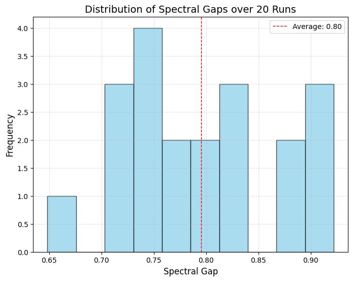

# Results and Conclusions 

In this document, we summarize the results of the Iterative Independent Model (IIM) graph simulation and present conclusions drawn from the analysis. The simulations were conducted with various options for graph generation, and key metrics such as spectral gap, graph diameter, and connectivity were evaluated.

## Graph Generation Process

We explored four different options for graph generation:

1. **Cloning every vertex** 
2. **Anticloning every vertex** 
3. **Alternating between cloning and anticloning** 
4. **Probabilistic cloning and anticloning (with probability `p`)**

## Mathematical background:
- A deeper understanding of the spectral gap's implications and its connection to clustering and network resilience is crucial to determining whether our findings support or contradict the article's assertions. By refining and analyzing the model, we strive to gain meaningful insights into the behavior of IIM graphs in this context.
  
- The article asserts that the graphs generated by IIM have a spectral gap of the graph's Laplacian matrix is bounded away from zero. This property suggests that these graphs exhibit strong clustering and robustness, making them more representative of social networks than randomly generated graphs. It is important to note that the article emphasizes that IIM graphs are less expansive compared to other random graphs, making them more reflective of the characteristics of social networks. In essence, IIM graphs strike a balance: they are moderately good expanders but not excessively so. This property aligns with the expectation of a spectral gap that is bounded away from 0 but still will be small. It also property implies that the graph has a small diameter, meaning the number of steps between any two vertices is minimized.
  
- But how much bounded away and what its borders?
Lets analyze the range of eigenvalues of the Laplacian matrix , denoted by 𝜆 (the spectral gap).
- The spectral gap 𝜆 of (L) is defined by  and the range of Laplacian matrix eigenvalues is **<PHOTO-range>**
𝜆 cannot equal zero because, in that case, both 𝜆1 and 𝜆𝑛−1 would be equal to 1. This scenario corresponds to a fully connected graph where every vertex is connected to itself, a structure that the IIM model does not generate.
- On the other hand, 𝜆!=1 because this results in two possibilities: either 𝜆1=0, indicating the graph is disconnected, or 𝜆𝑛−1=2, signifying the graph is bipartite. In our case, the assertion is that IIM graphs are connected, and neither of these scenarios aligns with the expected properties of the model.
- The range of 𝜆 is [0,1], and based on the expectations described earlier, we anticipate a value close to 1.
The basis for the research's claim that IIM graphs have properties more similar to social networks rests on the Expander-Mixing lemma which to give a lower bound on the spectral gap of any IIM grapg which is 1/15 (0.06666666666). (more interesting explanation link). 

## Results

### Example Graphs - 
We will examine the graph created from option 4 (Probabilistic cloning or anticloning based on a probability p = 0.6) and 3 steps with initial state of 2 connected nodes (option a).

### Spectral Gap Analysis

We ran the simulation 20 times (within the limitations of the runtime) and calculated the spectral gap for each run. As we can see The average spectral gap is calculated as follows:

- **Average Spectral Gap**: Average spectral gap over 15 runs: 0.7926149898118253
- **Average Spectral Gap**: Average spectral gap over 20 runs: 0.7950732294021161

#### Spectral Gap Distribution

**Description**: The plot shows the distribution of spectral gaps over 20 runs. This helps to understand how the spectral properties of the graph vary across different simulations.

## Conclusions

The results from the simulation show the following:

- The graph's spectral gap is closely related to the graph structure, and a higher spectral gap will indicate better connectivity.
- We obtained results (within the limitations of the computational model) that align with the article's assertions. The spectral gap, measured as 0.7950732294021161, is bounded away from zero and remains less than 1. This indicates that while IIM graphs are not poor expanders, they are also not exceptionally strong expanders. This characteristic aligns well with the behavior typically observed in social networks.
- We also found bound on the spectral within the limitations of the computational model
- Alternating cloning and anticloning introduce a unique balance between density and sparsity in the graph structure. **For more graphs from the same simulation looks here:** 
- The probabilistic approach introduces variability, which can lead to graphs with more varied spectral gaps.
- We can say that according to our simulation, the IIM model's ability to model social networks and clustering behavior was evident from the graph structure and spectral properties.

---

